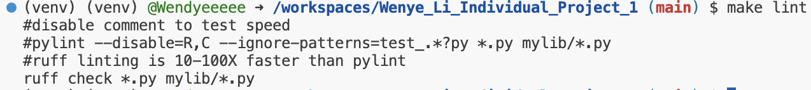
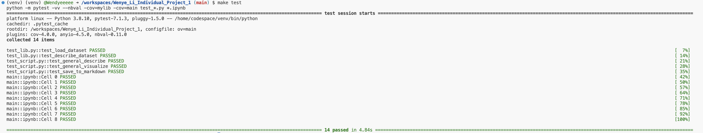

# Wenye_Li_Individual_Project_1

## Demo Link

https://youtu.be/dGS6l2Mz_no

## Badges

## Requirements

The project structure includes the following files:

- Jupyter Notebook with:
  - Cells that perform descriptive statistics using Polars or Panda. (main.ipynb)
  - Tested by using nbval plugin for pytest (Makefile)
- Python Script performing the same descriptive statistics using Polars or Panda (main.py)
- lib.py file that shares the common code between the script and notebook (mylib/lib.py)
- Makefile with the following: (Makefile)
  - Run all tests (must test notebook and script and lib)
  - Formats code with Python black
  - Lints code with Ruff
  - Installs code via: pip install -r requirements.txt
- test_script.py to test script (test_script.py)
- test_lib.py to test library (test_lib.py)
- Pinned requirements.txt (requirements.txt)
- GitHub Actions performs all four Makefile commands with badges for each one in
  the README.md (.github/workflows/format.yml, .github/workflows/install.yml, .github/workflows/lint.yml, and .github/workflows/test.yml)

## Dataset

| Header                    | Definition                                                                              |
| ------------------------- | --------------------------------------------------------------------------------------- |
| `alcohol-use`             | Percentage of those in an age group who used alcohol in the past 12 months              |
| `alcohol-frequency`       | Median number of times a user in an age group used alcohol in the past 12 months        |
| `marijuana-use`           | Percentage of those in an age group who used marijuana in the past 12 months            |
| `marijuana-frequency`     | Median number of times a user in an age group used marijuana in the past 12 months      |
| `cocaine-use`             | Percentage of those in an age group who used cocaine in the past 12 months              |
| `cocaine-frequency`       | Median number of times a user in an age group used cocaine in the past 12 months        |
| `crack-use`               | Percentage of those in an age group who used crack in the past 12 months                |
| `crack-frequency`         | Median number of times a user in an age group used crack in the past 12 months          |
| `heroin-use`              | Percentage of those in an age group who used heroin in the past 12 months               |
| `heroin-frequency`        | Median number of times a user in an age group used heroin in the past 12 months         |
| `hallucinogen-use`        | Percentage of those in an age group who used hallucinogens in the past 12 months        |
| `hallucinogen-frequency`  | Median number of times a user in an age group used hallucinogens in the past 12 months  |
| `inhalant-use`            | Percentage of those in an age group who used inhalants in the past 12 months            |
| `inhalant-frequency`      | Median number of times a user in an age group used inhalants in the past 12 months      |
| `pain-releiver-use`       | Percentage of those in an age group who used pain relievers in the past 12 months       |
| `pain-releiver-frequency` | Median number of times a user in an age group used pain relievers in the past 12 months |
| `oxycontin-use`           | Percentage of those in an age group who used oxycontin in the past 12 months            |
| `oxycontin-frequency`     | Median number of times a user in an age group used oxycontin in the past 12 months      |
| `tranquilizer-use`        | Percentage of those in an age group who used tranquilizer in the past 12 months         |
| `tranquilizer-frequency`  | Median number of times a user in an age group used tranquilizer in the past 12 months   |
| `stimulant-use`           | Percentage of those in an age group who used stimulants in the past 12 months           |
| `stimulant-frequency`     | Median number of times a user in an age group used stimulants in the past 12 months     |
| `meth-use`                | Percentage of those in an age group who used meth in the past 12 months                 |
| `meth-frequency`          | Median number of times a user in an age group used meth in the past 12 months           |
| `sedative-use`            | Percentage of those in an age group who used sedatives in the past 12 months            |
| `sedative-frequency`      | Median number of times a user in an age group used sedatives in the past 12 months      |

## Preparation, Checking, and Testing

- Open codespaces
- Install dependecies by using `make install` command
- Format code by using `make format` command
  
- Lint code by using `make lint` command
  
- Test code by using `make test` command
  

## Descriptive Stats and Visualizations

The descriptive statistics and vizualizations are generated through pushes via `actions-user` using `make generate_and_push` command. [descriptive statistics and vizualizations](/summary.md)
