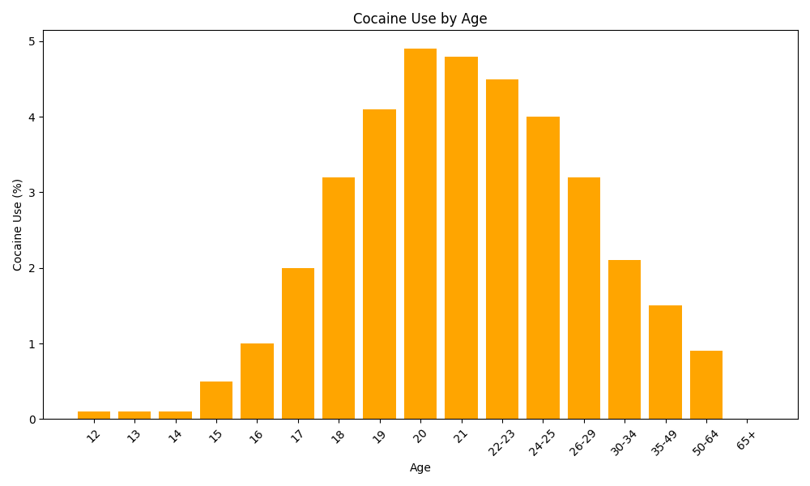

# Dataset Statistics
|       |       n |   alcohol_use |   alcohol_frequency |   marijuana_use |   marijuana_frequency |   cocaine_use |   crack_use |   heroin_use |   hallucinogen_use |   hallucinogen_frequency |   inhalant_use |   pain_releiver_use |   pain_releiver_frequency |   oxycontin_use |   tranquilizer_use |   tranquilizer_frequency |   stimulant_use |   stimulant_frequency |   meth_use |   sedative_use |   sedative_frequency |
|:------|--------:|--------------:|--------------------:|----------------:|----------------------:|--------------:|------------:|-------------:|-------------------:|-------------------------:|---------------:|--------------------:|--------------------------:|----------------:|-------------------:|-------------------------:|----------------:|----------------------:|-----------:|---------------:|---------------------:|
| count |   17    |       17      |             17      |         17      |               17      |      17       |   17        |    17        |           17       |                 17       |      17        |            17       |                   17      |       17        |           17       |                  17      |        17       |               17      |  17        |      17        |              17      |
| mean  | 3251.06 |       55.4294 |             33.3529 |         18.9235 |               42.9412 |       2.17647 |    0.294118 |     0.352941 |            3.39412 |                  8.41176 |       1.38824  |             6.27059 |                   14.7059 |        0.935294 |            2.80588 |                  11.7353 |         1.91765 |               31.1471 |   0.382353 |       0.282353 |              19.3824 |
| std   | 1297.89 |       26.8789 |             21.3188 |         11.9598 |               18.3626 |       1.81677 |    0.235772 |     0.333762 |            2.79251 |                 15.0002  |       0.927283 |             3.16638 |                    6.9351 |        0.608216 |            1.75338 |                  11.4852 |         1.40767 |               85.9738 |   0.262762 |       0.138    |              24.8335 |
| min   | 2223    |        3.9    |              3      |          1.1    |                4      |       0       |    0        |     0        |            0.1     |                  2       |       0        |             0.6     |                    7      |        0        |            0.2     |                   4.5    |         0       |                2      |   0        |       0        |               3      |
| 25%   | 2469    |       40.1    |             10      |          8.7    |               30      |       0.5     |    0        |     0.1      |            0.6     |                  3       |       0.6      |             3.9     |                   12      |        0.4      |            1.4     |                   6      |         0.6     |                7      |   0.2      |       0.2      |               6.5    |
| 50%   | 2798    |       64.6    |             48      |         20.8    |               52      |       2       |    0.4      |     0.2      |            3.2     |                  3       |       1.4      |             6.2     |                   12      |        1.1      |            3.5     |                  10      |         1.8     |               10      |   0.4      |       0.3      |              10      |
| 75%   | 3058    |       77.5    |             52      |         28.4    |               52      |       4       |    0.5      |     0.6      |            5.2     |                  4       |       2        |             9       |                   15      |        1.4      |            4.2     |                  11      |         3       |               12      |   0.6      |       0.4      |              17.5    |
| max   | 7391    |       84.2    |             52      |         34      |               72      |       4.9     |    0.6      |     1.1      |            8.6     |                 52       |       3        |            10       |                   36      |        1.7      |            5.4     |                  52      |         4.1     |              364      |   0.9      |       0.5      |             104      |
## Median Values
|                         |      0 |
|:------------------------|-------:|
| n                       | 2798   |
| alcohol_use             |   64.6 |
| alcohol_frequency       |   48   |
| marijuana_use           |   20.8 |
| marijuana_frequency     |   52   |
| cocaine_use             |    2   |
| cocaine_frequency       |    5   |
| crack_use               |    0.4 |
| crack_frequency         |    6   |
| heroin_use              |    0.2 |
| heroin_frequency        |   50   |
| hallucinogen_use        |    3.2 |
| hallucinogen_frequency  |    3   |
| inhalant_use            |    1.4 |
| inhalant_frequency      |    4   |
| pain_releiver_use       |    6.2 |
| pain_releiver_frequency |   12   |
| oxycontin_use           |    1.1 |
| oxycontin_frequency     |   12   |
| tranquilizer_use        |    3.5 |
| tranquilizer_frequency  |   10   |
| stimulant_use           |    1.8 |
| stimulant_frequency     |   10   |
| meth_use                |    0.4 |
| meth_frequency          |   24   |
| sedative_use            |    0.3 |
| sedative_frequency      |   10   |
## Visualizations
### Alcohol Use Histogram

### Marijuana Use Line Chart

### Cocaine Use Bar Chart

